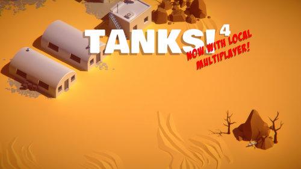
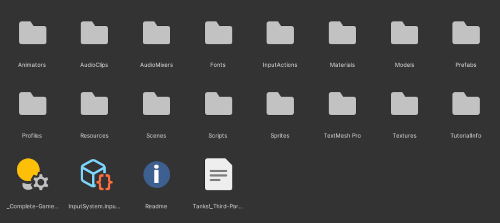
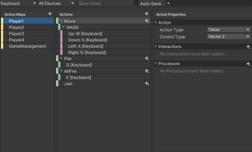
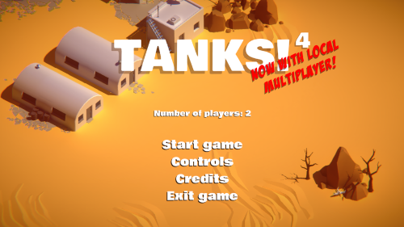
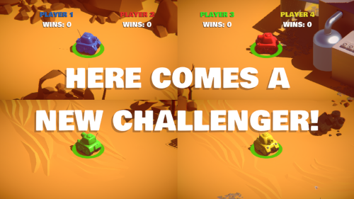
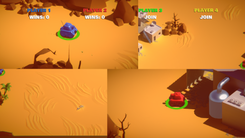
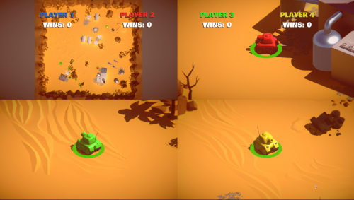

# Tanks! Tanks! Tanks! Tanks!

Salvador Banderas Rovira



## Tabla de contenidos

1. [Introducción](#introducción)
2. [*Release* en GitHub y GitLab](#release-en-github-y-gitlab)
3. [Objetivos](#objetivos)
4. [Desarrollo](#desarrollo)
   1. [Compleción del tutorial y *fork* del repositorio](#compleción-del-tutorial-y-fork-del-repositorio)
   2. [Refactorización del código y *house-keeping*](#refactorización-del-código-y-house-keeping)
   3. [Implementación del New Input System](#implementación-del-new-input-system)
   4. [Adición del menú principal y la lógica de selección de jugadores](#adición-del-menú-principal-y-la-lógica-de-selección-de-jugadores)
   5. [Implementación de la lógica de juego y de la unión de nuevos jugadores](#implementación-de-la-lógica-de-juego-y-de-la-unión-de-nuevos-jugadores)
   6. [Implementación de Cinemachine para la gestión de cámaras](#implementación-de-cinemachine-para-la-gestión-de-cámaras)
5. [Créditos](#créditos)
    - [Tanks!](#tanks)
    - [Fuentes](#fuentes)
    - [Música](#música)
6. [Referencias](#referencias)
    - [New Input System](#new-input-system)
    - [Cinemachine and cameras](#cinemachine-and-cameras)

## Introducción

*Tanks! Tanks! Tanks! Tanks* (o *Tanks<sup>4</sup>*) es el nombre de mi prototipo para la primera Práctica de Evaluación Continua (PEC1) de la asignatura Juegos Multijugador (B2.503) del Máster en Diseño y Programación de Videojuegos de la UOC.

El objetivo de la práctica era implementar una versión mejorada del tutorial *Tanks!* de Unity, añadiendo funcionalidades relacionadas con el multijugador local con pantalla partida e implementado componentes como el New Input System o Cinemachine.

## *Release* en GitHub y GitLab

La *release* puede encontrarse tanto en [Github](https://github.com/ragart-uoc/uoc-b2.503-pec1/releases/tag/1.0.0) como en [GitLab](https://gitlab.com/ragart-uoc/b2.503/uoc-b2.503-pec1/-/releases/1.0.0). En el caso de GitHub, se incluye en la *release* los ficheros de la *build* para Win64, probada en Windows 11.

La *release* se corresponde con la versión 1.0.0 del proyecto y su nombre ("Fury") es una referencia a la película bélica del mismo nombre de 2014, de David Ayer, cuya trama gira alrededor de un tanque de guerra.

## Objetivos

Al finalizar la práctica, se han cumplido todos los objetivos obligatorios y opcionales:

- [x] Habilitar la selección de hasta cuatro jugadores
- [x] Dividir la pantalla conservando la relación de aspecto para dos jugadores y con la misma proporción para tres y cuatro jugadores
- [x] Configurar los controles de los cuatro jugadores en un único dispositivo de entrada
- [x] Permitir a los jugadores unirse a la partida en cualquier momento
- [x] Volver a la página de selección de jugadores al finalizar la partida
- [x] (Opcional) Añadir un minimapa cuando haya tres jugadores en la partida
- [x] (Opcional) Implementar Cinemachine para la gestión de cámaras
- [x] (Opcional) Implementar el New Input System de Unity
- [x] (Extra) Implementar un menú de pausa
- [x] (Extra) Añadir a la UI un indicador de los jugadores en la partida y sus victorias

## Desarrollo

A continuación se detallan los pasos seguidos para la realización de la práctica. Se incluyen los commits de GitLab y GitHub para facilitar la localización de los cambios realizados, así como capturas del editor y del juego para facilitar la ejemplificación de lo descrito.

### Compleción del tutorial y *fork* del repositorio

El primer paso en el desarrollo de la práctica fue completar el tutorial proporcionado en el contexto de la asignatura, implementando lo requerido para ver la manera en la que se habían implementando el sistema de *input* antiguo y la gestión de cámaras de Unity.

Una vez finalizado, el proyecto resultante se alojó de manera pública tanto en [GitLab (uoc-b2.503-m1)](https://gitlab.com/ragart-uoc/b2.503/uoc-b2.503-m1) como en [GitHub (uoc-b2.503-m1)](https://github.com/ragart-uoc/uoc-b2.503-m1) y se procedió a crear un *fork* **privado** del repositorio en ambas plataformas para dar comienzo a las tareas de la práctica. El control de versiones se ha realizado en las dos plataformas, configurando [GitLab  (uoc-b2.503-pec1)](https://gitlab.com/ragart-uoc/b2.503/uoc-b2.503-pec1) como `origin` y [GitHub(uoc-b2.503-pec1)](https://github.com/ragart-uoc/uoc-b2.503-pec1) como `upstream` e incluyendo la URL de los dos remotos como `pushurl`. 

### Refactorización del código y *house-keeping*

| Commit | GitLab | GitHub |
| :--- | :--- | :--- |
| b104cb94 Reorganized project directories and files | [GitLab](https://gitlab.com/ragart-uoc/b2.503/uoc-b2.503-pec1/-/commit/b104cb9492d6c4f01cf9c6a3308431f5db66ceb6) | [GitHub](https://github.com/ragart-uoc/uoc-b2.503-pec1/commit/b104cb9492d6c4f01cf9c6a3308431f5db66ceb6) |
| e2d00175 Switched asset serialization mode to force text | [GitLab](https://gitlab.com/ragart-uoc/b2.503/uoc-b2.503-pec1/-/commit/e2d00175b14dcefdb0b9c6cdac980c00fd813380) | [GitHub](https://github.com/ragart-uoc/uoc-b2.503-pec1/commit/e2d00175b14dcefdb0b9c6cdac980c00fd813380) |
| c2d70088 Refactored all scripts | [GitLab](https://gitlab.com/ragart-uoc/b2.503/uoc-b2.503-pec1/-/commit/c2d700884148dbdbc72024a4f82e2ace9085c8ef) | [GitHub](https://github.com/ragart-uoc/uoc-b2.503-pec1/commit/c2d700884148dbdbc72024a4f82e2ace9085c8ef) |

Lo primero que se hizo fue "hacer propio" el código del tutorial, refactorizando el código y realizando un *house-keeping* de la base de código, eliminando los ficheros innecesarios y reorganizando la estructura de directorios, de cara tanto a facilitar la implementación de nuevas funcionalidades como a entender el origen de las actuales.

Entre otras, se llevaron a cabo las siguientes tareas:

- Eliminación de los *scripts* duplicados, así como de otros ficheros redundantes o en desuso.
- Reestructuración de los directorios y reubicación de los ficheros.
- Renombrado de entidades (clases, métodos, propiedades, etc.) para adaptarlos a la convención de nombres de C#, según lo sugerido por el IDE JetBrains Rider.
- Inclusión del *namespace* base "PEC1" y adecuación de los existentes. 
- Adición de comentarios a todas las clases y métodos siguiendo la convención de [documentación de C# de Microsoft](https://learn.microsoft.com/es-es/dotnet/csharp/language-reference/language-specification/documentation-comments).



*Figura 1. Estructura de directorios*

Probablemente el cambio más importante sea la extracción de ciertas lógicas de los *scripts* existentes y la creación de nuevos *scripts* para encapsularlas. Por ejemplo, la clase existente `PEC1.Managers.TankManager` se convirtió en la entidad `PEC1.Entities.Tank` y las lógicas relacionadas con la gestión de los jugadores y los tanques se encapsularon en las clases `PEC1.Managers.PlayerManager` y una nueva versión de `PEC1.Managers.TankManager`, respectivamente.

Cabe decir que esta refactorización no se llevó a cabo de manera completa desde un inicio y que se fueron realizando cambios a medida que se iban implementando las nuevas funcionalidades.

### Implementación del New Input System

| Commit | GitLab | GitHub |  
| :--- | :--- | :--- |
| e836c4c8 Installed Cinemachine and Input System packages | [GitLab](https://gitlab.com/ragart-uoc/b2.503/uoc-b2.503-pec1/-/commit/e836c4c8f3da903f399b14cd44a2f8eb27ef581e) | [GitHub](https://github.com/ragart-uoc/uoc-b2.503-pec1/commit/e836c4c8f3da903f399b14cd44a2f8eb27ef581e) |
| b939155a Implemented Input System and created new tanks | [GitLab](https://gitlab.com/ragart-uoc/b2.503/uoc-b2.503-pec1/-/commit/b939155ac8b8285e061c713f78b98d5742346c84) | [GitHub](https://github.com/ragart-uoc/uoc-b2.503-pec1/commit/b939155ac8b8285e061c713f78b98d5742346c84) |

Como siguiente paso, se decidió implementar directamente el New Input System, ya que por su transversalidad en el proyecto se consideró que era más fácil implementarlo desde el principio que ir añadiendo funcionalidades con el sistema antiguo y luego migrarlas al nuevo.

Para ello, se instaló el paquete correspondiente y se deshabilitó el sistema antiguo. Luego se creó un *asset* de tipo `InputActions` con un `ControlScheme` para el teclado ("Keyboard") y un `ActionMap` para cada uno de los cuatro jugadores, así como para la gestión de la partida (pausa, unión de nuevos jugadores, etc.).



*Figura 2. Input Actions Asset*

Inicialmente, se había configurado un `ControlScheme` para cada jugador ("Keyboard1", "Keyboard2", etc.) y un único `ActionMap` que incorporaba las combinaciones de teclas para cada uno de los jugadores, pero con el desarrolló del resto de funcionalidades se consideró más efectiva la opción por la que finalmente se optó.

Una vez configurado el *asset*, se reescribieron (y simplificaron) los métodos de las clases `PEC1.Entities.TankMovement` y `PEC1.Entities.TankShooting` para que escucharan las acciones definidas en el paso anterior. Los `ActionMap` se asocian de manera dinámica al componente `PlayerInput` de los tanques mediante el método `AssignControlScheme()` de la entidad `PEC1.Entities.Tank` cada vez que se crea un tanque o que se reinicia al principio de turno.

```csharp
private void AssignControlScheme()
{
   m_PlayerInput.SwitchCurrentControlScheme("Keyboard", Keyboard.current);
   m_PlayerInput.SwitchCurrentActionMap("Player" + playerNumber);
}
```

El `ActionMap` relacionado con la gestión de la pantalla se asoció al componente `PlayerInput` del Singleton `PEC1.Managers.GameManager`.

### Adición del menú principal y la lógica de selección de jugadores

| Commit | GitLab | GitHub | 
| :--- | :--- | :--- |
| 77f30472 Replaced legacy text with TextMesh Pro | [GitLab](https://gitlab.com/ragart-uoc/b2.503/uoc-b2.503-pec1/-/commit/77f30472427f55ec4e849c606ba86ecc3c5d1806) | [GitHub](https://github.com/ragart-uoc/uoc-b2.503-pec1/commit/77f30472427f55ec4e849c606ba86ecc3c5d1806) |
| 83f013fc Added main menu and player selection logic | [GitLab](https://gitlab.com/ragart-uoc/b2.503/uoc-b2.503-pec1/-/commit/83f013fc3560b5f10c3da913ba2cfdba8cb192d6) | [GitHub](https://github.com/ragart-uoc/uoc-b2.503-pec1/commit/83f013fc3560b5f10c3da913ba2cfdba8cb192d6) |

El siguiente paso fue añadir una nueva escena en la que se configuró un menú principal, utilizando como fondo el propio escenario de la partida, e incluyendo las siguientes opciones:

- **Selección de jugadores:** permite seleccionar el número de jugadores que participarán en la partida.
- **Iniciar partida:** inicia la partida con el número de jugadores seleccionado.
- **Controles:** muestra una pantalla con los controles de cada jugador. Los controles se obtiene directamente del `ActionMap` asociado a cada jugador, de manera que no es necesario actualizarlos en caso de que haya cambios.
- **Créditos:** muestra una pantalla con los créditos del juego.
- **Salir del juego:** cierra la aplicación.



*Figura 3. Menú principal*

Además de los elementos de la interfaz, en este punto del desarrollo se definió la clase `PEC1.Managers.PlayerManager` para gestionar la selección de jugadores y su vinculación con los tanques (y posteriormente con las cámaras). Esta clase utiliza el método `DontDestroyOnLoad()` para asegurar su permanencia al cambiar de escena, ya que permite gestionar en cualquier momento los parámetros de la partida, y sólo se destruye cuando finaliza la partida y se regresa al menú principal.

### Implementación de la lógica de juego y de la unión de nuevos jugadores

| Commit | GitLab | GitHub |
| :--- | :--- | :--- |
| f0418de1 Separated game and player management and implemented joining logic | [GitLab](https://gitlab.com/ragart-uoc/b2.503/uoc-b2.503-pec1/-/commit/f0418de14bcb78581143ad07fb7e441b670dd98d) | [GitHub](https://github.com/ragart-uoc/uoc-b2.503-pec1/commit/f0418de14bcb78581143ad07fb7e441b670dd98d) | 

A continuación, se implementó la lógica de partida, incluyendo la unión de nuevos jugadores y la creación y reinicio de los tanques asociados a cada uno de ellos. Toda la lógica relacionada con esta parte se incluye dentro de la clase `PEC1.Managers.GameManager` y, si bien no fue necesario cambiar prácticamente el *game loop* original, sí fue necesario sustituir todas las referencias directas a los tanques o a las cámaras por llamadas a los métodos de la clase `PEC1.Managers.PlayerManager` que, como se indica en el punto anterior, contiene la lógica relativa a los jugadores durante toda la partida.

En el caso de la unión de nuevos jugadores, por ejemplo, se implementó la lógica de manera que, al pulsar determinadas teclas en el teclado, se crea un nuevo jugador, se le asocia un tanque de la lista de tanques y sus respectivos *spawn points*, se le asigna un *control scheme* y se le añade una nueva cámara virtual a partir de un *prefab*.



*Figura 4. Unión de nuevos jugadores*

### Implementación de Cinemachine para la gestión de cámaras

| Commit | GitLab | GitHub |
| :--- | :--- | :--- |
| 239f2dce Refactored camera management using Cinemachine | [GitLab](https://gitlab.com/ragart-uoc/b2.503/uoc-b2.503-pec1/-/commit/239f2dce345ea4bbfaf351692834d00913804f8a) | [GitHub](https://github.com/ragart-uoc/uoc-b2.503-pec1/commit/239f2dce345ea4bbfaf351692834d00913804f8a) |

La implementación de la lógica de cámaras y de Cinemachine se dejó para el final, una vez se había finalizado la lógica de partida.

Con Cinemachine se ha pretendido conseguir las siguientes características o simplificar las ya existente:

- Cada jugador tiene una cámara virtual asociada que sigue al tanque que controla y que sirven para activar el modo de pantalla partida.
- La cámara principal está asociada a una cámara virtual con el componente `CinemachineTargetGroup` que sigue siempre al conjunto de tanques que están en juego y que se adapta.
- La cámara del minimapa es también una cámara virtual que enfoca siempre al escenario completo desde una perspectiva ortográfica.



*Figura 5. Pantalla partida con Cinemachine*

La gestión de las cámaras se lleva a cabo a través de la clase `PEC1.Managers.CameraManager` y, entre otras cosas, se encarga de activar y desactivar las cámaras virtuales en función de los jugadores que están en juego y de los que se unen a la partida. En concreto, el método `AdjustCameras()` se encarga de reconfigurar las cámaras cada vez que hay un cambio.

Cuando sólo hay dos jugadores en la partida, sus cámaras guardan la relación de aspecto de la pantalla y se colocan en los extremos de la pantalla. Si se acercan hasta una determinada distancia, se desactiva el modo de pantalla partida y sus cámaras virtuales se desactivan, mostrando únicamente la cámara principal que, por una **decisión de diseño**, se mantiene siempre activa como fondo de pantalla.

Cuando hay más de dos jugadores, sus cámaras se colocan en cuatro cuadrantes, correspondientes cada uno a un jugador, todas en la misma proporción y manteniendo siempre la misma posición. Por ejemplo, si hay cuatro jugadores y uno de ellos muere, las cámaras de los otros tres no se ven afectadas y el hueco que deja el jugador muerto se rellena con la cámara ortográfica del minimapa.



*Figura 6. Minimapa*

### Ajustes finales

| Commit | GitLab | GitHub |
| :--- | :--- | :--- |
| ea51b50b Removed unused scripts | [GitLab](https://gitlab.com/ragart-uoc/b2.503/uoc-b2.503-pec1/-/commit/ea51b50b401bd2532b81b380c6623e5169106b18) | [GitHub](https://github.com/ragart-uoc/uoc-b2.503-pec1/commit/ea51b50b401bd2532b81b380c6623e5169106b18) |
| 4f9ab321 Changed game over behaviour | [GitLab](https://gitlab.com/ragart-uoc/b2.503/uoc-b2.503-pec1/-/commit/4f9ab321f30c0ede802effa863a7d89b977f6789) | [GitHub](https://github.com/ragart-uoc/uoc-b2.503-pec1/commit/4f9ab321f30c0ede802effa863a7d89b977f6789) |
| 0bdd51a4 Fixed tanks not being added to the target group on reset | [GitLab](https://gitlab.com/ragart-uoc/b2.503/uoc-b2.503-pec1/-/commit/0bdd51a4553469b5c873a778bb1ebc97d8187ce6) | [GitHub](https://github.com/ragart-uoc/uoc-b2.503-pec1/commit/0bdd51a4553469b5c873a778bb1ebc97d8187ce6) |
| af71239a Added pause menu | [GitLab](https://gitlab.com/ragart-uoc/b2.503/uoc-b2.503-pec1/-/commit/af71239a7ca79a739dfdaf898a6e7f11a7786d53) | [GitHub](https://github.com/ragart-uoc/uoc-b2.503-pec1/commit/af71239a7ca79a739dfdaf898a6e7f11a7786d53) |
| 1f4bc22f Updated version format | [GitLab](https://gitlab.com/ragart-uoc/b2.503/uoc-b2.503-pec1/-/commit/1f4bc22fab9f278c14e1dfc1467b591b41e791c7) | [GitHub](https://github.com/ragart-uoc/uoc-b2.503-pec1/commit/1f4bc22fab9f278c14e1dfc1467b591b41e791c7) |
| bd1d3f48 Updated README.md | [GitLab](https://gitlab.com/ragart-uoc/b2.503/uoc-b2.503-pec1/-/commit/bd1d3f485667b48b8a512530f46cc1fb49add5d9) | [GitHub](https://github.com/ragart-uoc/uoc-b2.503-pec1/commit/bd1d3f485667b48b8a512530f46cc1fb49add5d9) |

Finalmente, se llevaron a cabo varios ajustes que permitieron mejorar la experiencia de juego, desde la corrección de errores hasta la inclusión de un menú de pausa para poder abandonar la partida en cualquier momento.

## Créditos

### Tanks

Todos los recursos del tutorial *Tanks!* son propiedad de Unity Technologies.

### Fuentes

- "Badaboom BB" - Blambot - https://www.dafont.com/es/badaboom-bb.font

### Música

- "March" - Spring/Spring Enterprises (Rasmus Damsgaard) - https://opengameart.org/content/march

## Referencias

### New Input System

- "2 Players on same input device" - Unity Forums - https://forum.unity.com/threads/2-players-on-same-input-device.763949/
- "Get name of mapped key with new input system?" - Unity Forums - https://forum.unity.com/threads/get-name-of-mapped-key-with-new-input-system.939464/
- "How would you handle a GetButtonDown Situaiton with the New Input System?" - Unity Forums - https://forum.unity.com/threads/how-would-you-handle-a-getbuttondown-situaiton-with-the-new-input-system.627184/
- "Input System - local multiplayer" - Unity Forums - https://forum.unity.com/threads/input-system-local-multiplayer.763829/
- "Input in Unity made easy (complete guide to the new system)" - GameDevBeginner - https://gamedevbeginner.com/input-in-unity-made-easy-complete-guide-to-the-new-system/
- "Keyboard Multiplayer" - Unity Forums - https://forum.unity.com/threads/keyboard-multiplayer.1098946/
- "Multiple players on Keyboard (New Input system)" - Unity Forums - https://forum.unity.com/threads/multiple-players-on-keyboard-new-input-system.725834/
- "Using Player Input with Send Messages" - Unity Forums - https://forum.unity.com/threads/using-player-input-with-send-messages.1012837/
- "button trigger behaviour: "release only" triggers twice!?" - Unity Forums - https://forum.unity.com/threads/button-trigger-behaviour-release-only-triggers-twice.707036/

### Cinemachine and cameras

- "2D Cinemachine TargetGroup" - Marc Tanenbaum [YouTube] - https://www.youtube.com/watch?v=gdOrm6MQVT8
- "Creating A Minimap System - Adding a Second Camera [2/6] Live 2017/5/24" - Unity [YouTube] - https://www.youtube.com/watch?v=52g_3CX7avo
- "How to Change Cinemachine Values Through Code Dynamically" - samyam [YouTube] - https://www.youtube.com/watch?v=wvPbSRTaH1I
- "How to Dynamically script viewport rect in unity" - Stack Overflow - https://stackoverflow.com/questions/58996405/how-to-dynamically-script-viewport-rect-in-unity
- "How to Make the Camera Follow the Player Using Cinemachine (Unity Tutorial)" - Ketra Games - https://www.youtube.com/watch?v=Z2KmfduirfU
- "Make a Follow Camera in Unity (with or without Cinemachine)" - GameDevBegginer - https://gamedevbeginner.com/how-to-follow-the-player-with-a-camera-in-unity-with-or-without-cinemachine/
- "New Input Manager Split Screen and Cinemachine" - Unity Forums - https://forum.unity.com/threads/new-input-manager-split-screen-and-cinemachine.811134/
- "Setting up a split screen using Cinemachine" - Unity [YouTube] - https://www.youtube.com/watch?v=X6Ou8InMUbg
- "Split Screen: New Input System & Cinemachine" - One Wheel Studio - https://onewheelstudio.com/blog/2022/2/3/split-screen-multi-player-with-unitys-new-input-system